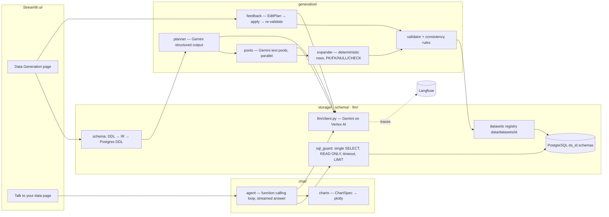
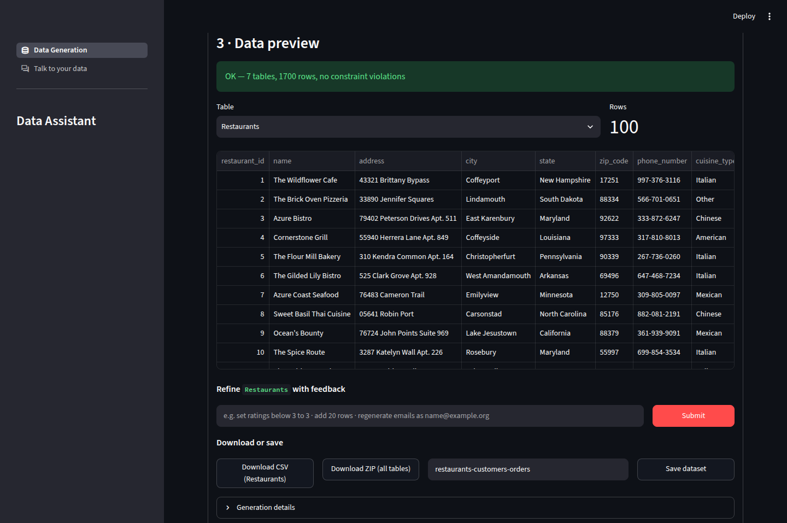
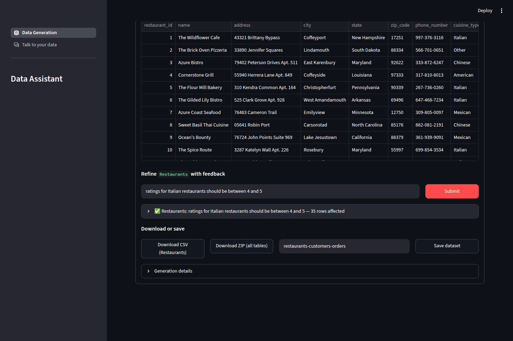
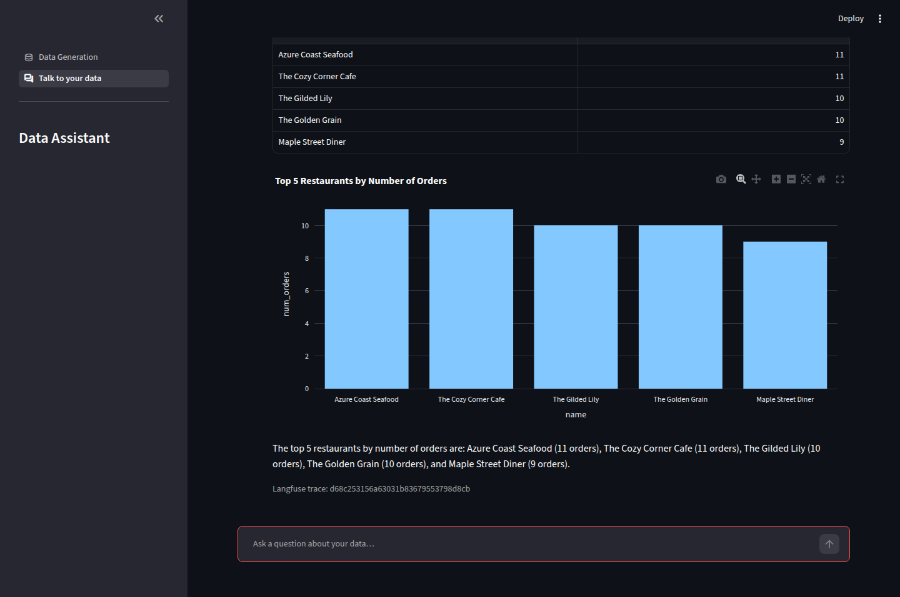

# GenAI Data Assistant — synthetic data from a DDL, then talk to it

A conversational data assistant built for the Grid Dynamics GenAI practice. Upload an SQL schema and the app
generates **constraint-valid, realistic synthetic data** for every table with Gemini (Vertex AI); refine it with
plain-language feedback, download CSV/ZIP, save it — then **ask questions about the data in natural language** and
get answers as text, tables and plots. Streamlit UI · PostgreSQL · Docker · Gemini via Google GenAI SDK ·
Langfuse observability.

| Requirement (project-spec/PROJECT.md) | Where it lives |
|---|---|
| Phase 1 — data generation from an uploaded DDL (5–7 tables; types, NULLs, dates, PK/FK integrity) | `schema/` (DDL → IR with sqlglot), `generation/` (Gemini planner + text pools, deterministic expander, validator) |
| Configurable row counts (e.g. 1000/table), instructions prompt, temperature, seed | Data Generation page → *Instructions and parameters* |
| Per-table preview, textual feedback edits with Submit | Data Generation page → *Data preview* / *Feedback*; `generation/feedback.py` (structured EditPlan, deterministic apply, re-validation) |
| CSV / ZIP download; datasets stored for later use | `generation/export.py`; registry `data/datasets/<id>/` + PostgreSQL schema `ds_<id>` |
| Phases 2–3 — "Talk to your data": NL → SQL → text, tables, plots | `chat/` (Gemini function calling `run_sql` / `render_chart`, streamed answers), `storage/sql_guard.py` (read-only SQL) |
| Gemini 2.x via Google GenAI SDK, Vertex AI auth (ADC), structured output + streaming + function calling | `llm/client.py` (the only Gemini entry point), `config.py` (`GEMINI_MODEL=gemini-2.5-flash`) |
| Streamlit UI (sidebar tabs), PostgreSQL, Docker, Langfuse | `ui/`, `docker-compose.yml`, `observability.py` |

## Architecture



Layers depend strictly downward (`ui → chat | generation → storage | schema | llm → config | observability`) and
`make arch-check` enforces it. Integrity (PK uniqueness, FK existence, NOT NULL, ENUM/CHECK, VARCHAR length, decimal
scale) is enforced in code; Gemini only supplies realism and semantics. Details: [docs/architecture.md](docs/architecture.md),
[docs/db-rules.md](docs/db-rules.md), [docs/gemini-rules.md](docs/gemini-rules.md), decisions in [DECISIONS.md](DECISIONS.md).

Every generation run is a Langfuse trace `data_generation` and every chat question a trace `talk_to_data_turn`
(session id = the browser session, nested GENERATIONs per Gemini call, a span per SQL/chart tool execution). The trace
id is shown in the UI under *Generation details* and under each answer.

## Prerequisites

- Linux/macOS with **GNU make ≥ 4** (the Makefile uses `.RECIPEPREFIX`; on macOS `brew install make` and use `gmake`),
  **Docker + Compose v2**, **[uv](https://docs.astral.sh/uv/)** (installs Python 3.14 itself) and the **gcloud SDK**.
- A Google account with Vertex AI access to project `gd-gcp-gridu-genai` (see
  `project-spec/gemini-access-instructions.md`). Authentication is Application Default Credentials — no API keys.
- Optional: Langfuse keys in `project-spec/creds.local` (`LANGFUSE_PUBLIC_KEY=…`, `LANGFUSE_SECRET_KEY=…`). Without
  them the app runs with tracing disabled.

## Setup

```bash
gcloud auth application-default login          # griddynamics.com account, project gd-gcp-gridu-genai
gcloud auth application-default set-quota-project gd-gcp-gridu-genai   # optional: silences the quota-project warning
make setup        # uv sync; creates .env from .env.example and injects LANGFUSE_* from project-spec/creds.local
make db-up        # PostgreSQL 17 in Docker, waits until healthy
make check-env    # PASS/FAIL per dependency: Python, ADC → Vertex call, Langfuse auth, PostgreSQL
```

All settings are environment variables in `.env` (table in [docs/environment.md](docs/environment.md)); the defaults
work for the compose stack. Secrets never leave `.env` / `project-spec/creds.local` (both gitignored).

## Run

```bash
make run          # local Streamlit on http://localhost:8501 (PostgreSQL from make db-up); make run PORT=8502 to change
make docker-up    # full stack in Docker: postgres + app on http://localhost:8501 (rebuilds the image)
make docker-down  # stop the stack (data volume is kept)
```

The Docker app container mounts `~/.config/gcloud` read-only as ADC (override with `GCLOUD_CONFIG_DIR=…`) and the
`./data` directory for the dataset registry; `APP_PORT` / `POSTGRES_PORT` change the published ports.

## Using the app

### Data Generation
1. **Schema** — *Upload file* (`.sql`, `.txt`, `.ddl`), *Sample schema* (`restaurants`, `library`, `company` from
   `project-spec/`) or *Paste DDL*. The schema is parsed immediately: the table list is confirmed and *Tables, columns and
   keys* / *Show DDL* expanders show the parsed structure; parse errors quote the failing line with a caret.
2. **Instructions and parameters** — a free-text prompt (e.g. *family-run Italian and Indian restaurants in New
   Jersey; realistic dish names; reviews in English*), then, in the *Advanced parameters* expander, *Temperature*,
   *Rows per table* (default 100, max `MAX_ROWS_PER_TABLE`), *Seed* and the *Use Gemini* toggle (off = offline
   heuristics + Faker, useful without network). **Generate** shows
   per-stage progress (plan → text pools → expand → validate).
3. **Data preview** — one table at a time (selectbox), with the row count and the validation result.
4. **Feedback** — type an instruction for the selected table and **Submit**, e.g. *set every rating of Italian
   restaurants to 5*, *make 30% of the orders cancelled*, *use only Polish first names*. Gemini turns the text into a
   structured edit plan, the plan is applied deterministically, dependent/aggregate columns are recomputed and the
   dataset is re-validated. Each edit is logged with the affected row count and can be inspected.
5. **Download or save** — *Download CSV* (selected table), *Download ZIP (all tables)*, or name the dataset and
   **Save dataset**: it is written to `data/datasets/<id>/` (manifest, DDL, CSVs) and loaded into PostgreSQL schema
   `ds_<id>` with real PK/FK constraints.

### Talk to your data
Pick a saved dataset (*Load into PostgreSQL* appears if it is only on disk), then ask in the chat box:
*How many orders were placed last month?*, *Top 5 restaurants by revenue as a bar chart*, *Average rating per
cuisine*. Gemini answers through function calling: `run_sql` executes guarded read-only SQL (single `SELECT`, `READ
ONLY` transaction, statement timeout, row cap) and `render_chart` draws bar/line/scatter/pie/histogram charts with
plotly; the final answer streams token by token. Each SQL statement appears in an expander with its result table
below it, then the streamed answer, then the Langfuse trace id (paste it into the Langfuse search box). *Clear chat* resets the conversation.

## Verification

| Command | What it checks | Needs |
|---|---|---|
| `make check` | ruff, mypy, architecture rules, unit tests (offline, < 60 s), Streamlit AppTest e2e | nothing |
| `make db-up && make test-int` | Postgres loader, read-only executor, dataset save/load | Docker |
| `make test-llm` | real Gemini: structured output, planner, pools, engine, feedback, agent, Langfuse traces | ADC + Langfuse |
| `make e2e` · `make e2e-llm E2E_ARGS="--schema restaurants --rows 200"` | 3 sample schemas → generate → validate → load into PostgreSQL (offline / with Gemini) | Docker (+ ADC) |
| `make check-all` | everything above | all |
| `make exit-check` | session-end gate for agentic development (check + feature list + progress file) | nothing |

Evidence for every feature (command + output lines + trace ids) is recorded in [docs/features.md](docs/features.md);
milestone gates were run by independent fresh-context verifier agents (see [PROGRESS.md](PROGRESS.md)).

## 5-minute demo script

| Time | Step | What to show |
|---|---|---|
| 0:00 | `make db-up && make run`, open http://localhost:8501 | Sidebar tabs *Data Generation* / *Talk to your data* |
| 0:30 | Schema → *Sample schema* → `restaurants` | Parsed table list; *Tables, columns and keys* and *Show DDL* expanders |
| 1:00 | Instructions: *family-run Italian and Indian restaurants in New Jersey; realistic dish names; reviews in English* · Rows per table **200** · **Generate** | Progress log: plan (Gemini structured output), text pools (parallel Gemini calls), expand, validate = OK |
| 2:00 | Preview `Restaurants`, `Menu`, `Orders` | Realistic names/dishes/prices; FK ids point to existing parents; dates in range |
| 2:30 | Feedback on `Restaurants`: *ratings for Italian restaurants should be between 4 and 5* → **Submit** | Structured edit plan, "N rows affected" (35 in the screenshot), re-validation; preview updates |
| 3:15 | *Download ZIP (all tables)*; name it `restaurants-demo` → **Save dataset** | Saved to `data/datasets/<id>/` and loaded into PostgreSQL `ds_<id>` |
| 3:45 | Talk to your data → *How many customers placed more than one order?* | `run_sql` call with SQL + table, streamed answer |
| 4:15 | *Top 5 restaurants by number of orders as a bar chart* | Second `run_sql` + `render_chart` → plotly bar chart |
| 4:45 | Expand *SQL*; paste the trace id into Langfuse | Trace `talk_to_data_turn` with nested GENERATIONs and `tool.run_sql` span |

A larger dataset (1000 rows/table, Gemini-generated, ~2.5 minutes) can be prepared before the demo with
`uv run python scripts/e2e_smoke.py --schema restaurants --rows 1000 --llm --keep` — it appears in the Talk to your
data dataset list as `smoke-restaurants` (7 tables, 10 000 rows: Order_Items and Reviews are scaled up by the planner).

## Screenshots

| Data Generation — preview of Gemini-generated data | Feedback edit applied and logged |
|---|---|
|  |  |

Talk to your data — SQL result table, plotly chart from `render_chart`, streamed answer and the Langfuse trace id:



## Repository layout

```
CLAUDE.md · PROGRESS.md · DECISIONS.md    agent harness, current state, design decisions
docs/            PLAN.md (milestones + gates) · features.md · architecture · gemini/db/ui/testing rules · environment
src/genai_data_gen_project/
  config.py observability.py   settings (.env), Langfuse/OpenInference init
  llm/        Gemini client (structured, streaming, tools, retries)
  schema/     DDL → IR (sqlglot) · dependency order · Postgres DDL emitter
  generation/ planner · pools · expander · validator · consistency · feedback · export · engine
  storage/    Dataset · CSV · registry · Postgres loader · sql_guard · read-only executor
  chat/       talk-to-data agent · tools · charts
  ui/         app.py (st.navigation) · pages/ · state.py · services.py
tests/           unit (offline) · integration (Postgres) · e2e (AppTest) · llm (real Gemini, RUN_LLM_TESTS=1)
scripts/         check_env · e2e_smoke · features · arch_check · exit_check
project-spec/    PROJECT.md, sample DDLs, creds.local (gitignored)
```

This project was built with Claude Code following harness-engineering practice: [CLAUDE.md](CLAUDE.md) holds the hard
constraints and session protocol, [docs/features.md](docs/features.md) is the machine-checked feature list (WIP = 1,
evidence required to pass), [docs/loop.md](docs/loop.md) the work loop and gate-verifier protocol.

## Troubleshooting

Symptom → fix list in [docs/environment.md](docs/environment.md). The most common: ADC expired →
`gcloud auth application-default login`; `429 RESOURCE_EXHAUSTED` → lower `LLM_MAX_CONCURRENCY`; PostgreSQL
`connection refused` → `make db-up`; Langfuse auth failure → keys are for the EU host `https://cloud.langfuse.com`.

## Limitations

- Designed for schemas of up to ~7 tables; `MAX_ROWS_PER_TABLE` (default 5000) caps a generation run.
- Questions are answered with PostgreSQL SQL over one saved dataset at a time; results are capped at `SQL_ROW_LIMIT`
  rows (500) and `SQL_TIMEOUT_MS` (15 s) per query.
- Text values come from Gemini-generated pools; very large tables recycle pool values while keeping uniqueness
  constraints satisfied.
