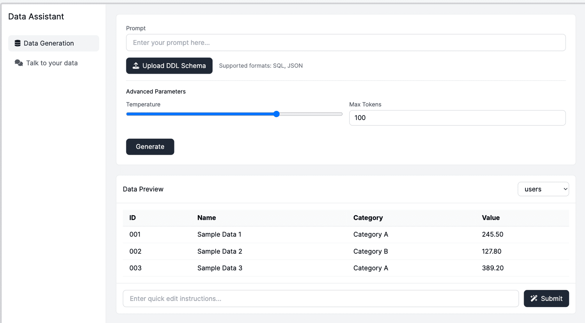

## Overview

The goal of this practice is to implement a conversational AI application with two primary functionalities: synthetic data generation and natural language data querying. This task is broken down into 3 distinct phases:

- Phase 1 involves developing a core data generation engine. This engine must interpret the provided SQL schemas, identifying tables, columns, data types, and constraints. A data generation module will then use this parsed information to create realistic synthetic data, respecting all defined constraints, especially foreign keys, to ensure data integrity. The system should be capable of generating a configurable amount of data, for instance, a thousand rows per table.

- Phases 2 and 3 focus on implementing the Conversational Core module, which allows users to query SQL data using natural language (talk-to-your-data) and present results in the form of text, tables, and plots.

By the end of the practice, you need to develop the user friendly UI and present both the results and the source code to your professor.

## Technical Requirements

- LLM: Gemini 2.0 Flash (or newer)
    - Please use streaming, function calling and json/structured output during implementation where appropriate.

- SDK: Google GenAI SDK (opens in a new tab) (with Vertex AI Auth through GCP project)
    - [Gemini access instructions](gemini-access-instructions.md)

- UI: Streamlit
- DB: PostgreSQL
- Docker
- Langfuse for observability (my langfuse credentials in [creds.local](creds.local)).

## Functional Requirements:

### Phase 1: Synthetic Data Generation

- The system should generate consistent and valid data for the provided DDL schema (up to 5-7 Tables) and instructions [data types, null values, date and time formats, primary and foreign keys, etc].

- The system should allow a user to modify the data through textual feedback from the user.

- Generated data can be downloaded as csv / zip archive and stored in the system so that later it is accessible in ‘Talk to you data’ tab.

## Sample DDL Schemas:

- [library_mgm.ddl](library_mgm_schema.ddl)
- [restaurants.ddl](restrurants_schema.ddl)
- [company_employee.ddl](company_employee_schema.ddl)

## UI requirements:

- Sidebar for main tabs: Data Generation, Talk to your data.

- Data Generation tab:
    - User can upload as a file with DDL schema (.sql, .txt or .ddl file)
    - User can add text instructions (prompt) for the data in a text box
    - User can set additional generation parameters, such as temperature
    - Generation happens after user clicks “Generate” button
    - After data is generated, user can check the preview for each of the generated tables
    - User can apply changes for each of the tables by entering the prompt and clicking Submit button

## Sample UI interface:

